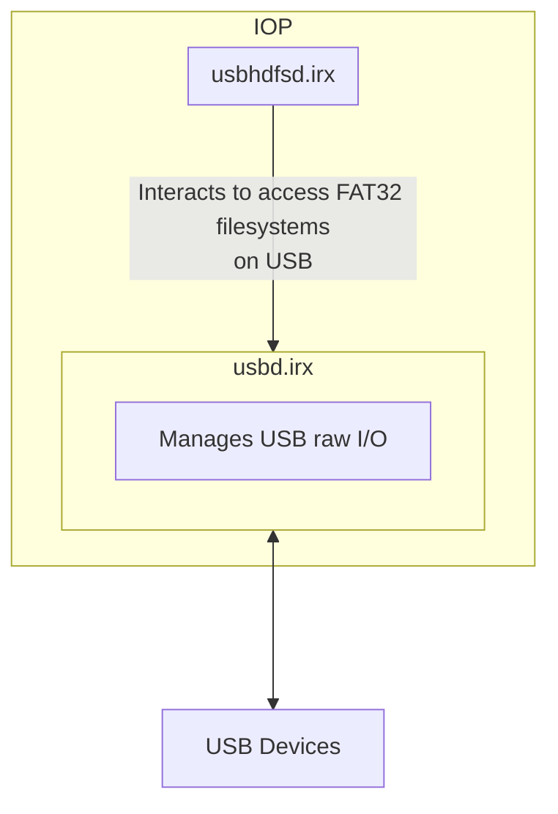
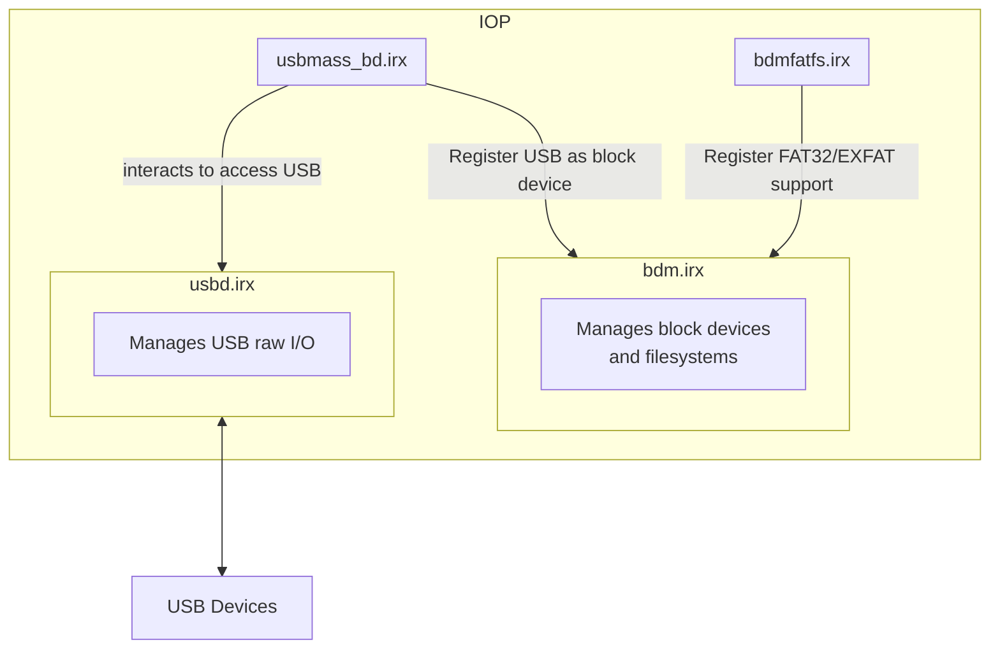
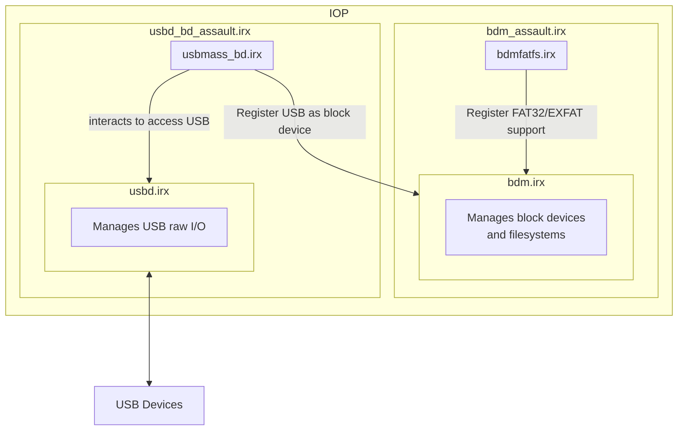

# BDM Assault

BDM Assault is a homebrew project for PS2 that aims to bring EXFAT USB support to those old closed source homebrew apps that can load external USB drivers that people still use today (POPStarter, FreeMcBoot).

## Usage

To use this project you have to place the two IRX binaries provided at the [release section](https://github.com/israpps/BDMAssault/releases) into the path that your app looks for

### POPStarter
- `bdm_assault.irx` must be pasted into `mc?:/POPSTARTER/usbd.irx`
- `usbd_bd_assault.irx` must be pasted into `mc?:/POPSTARTER/usbhdfsd.irx`

### FreeMcBoot
- `bdm_assault.irx` must be pasted into `mc?:/SYS-CONF/USBD.IRX`
- `usbd_bd_assault.irx` must be pasted into `mc?:/SYS-CONF/USBHDFSD.IRX`

### old wLaunchELF versions
- `bdm_assault.irx` must be pasted into the path you configured for `USBD.IRX`
- `usbd_bd_assault.irx` must be pasted into the path you configured for `USBHDFSD.IRX`

### Any other homebrew
- find out by yourself. I cant remember any other

## Why do we need this?
Because we had to merge 4 IRX drivers into 2 IRX drivers. because the original USB driver design (before BDM) just used two IRX.

  
 <b> Original USB drivers design </b> 

  
 <b> BDM USB design </b> 

  
 <b> BDMAssault design </b> 

## CREDITS

the softwares found here were taken and modified from [__PS2SDK__](https://github.com/ps2dev/ps2sdk)

- krHACKen: for letting me know POPStarter loads external USB drivers (wich ended up in the creation of this project)
- juankytutoriales: for making tests in real hardware
- everyone that collaborated to PS2SDK